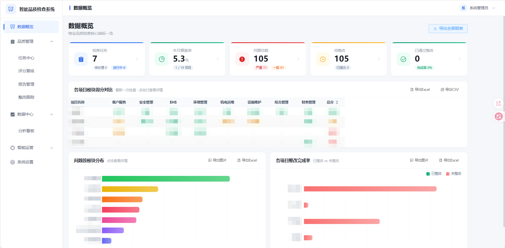
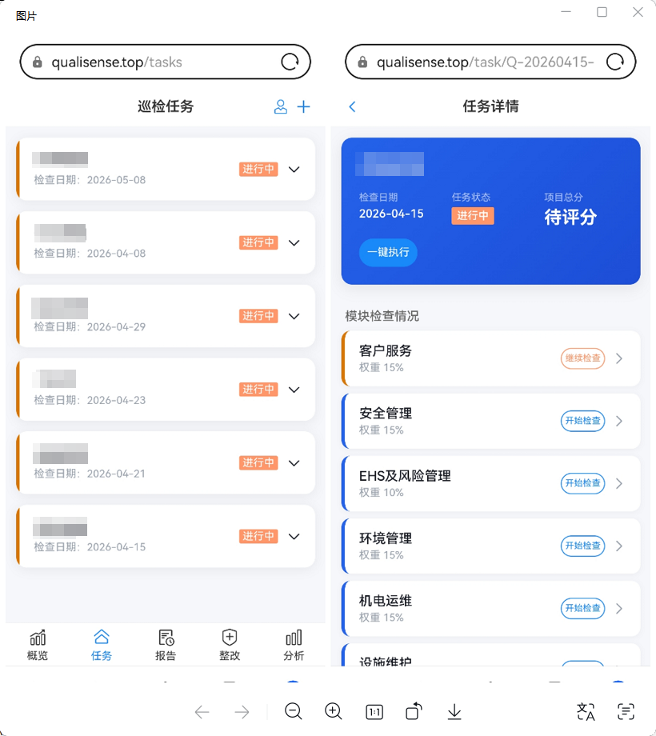
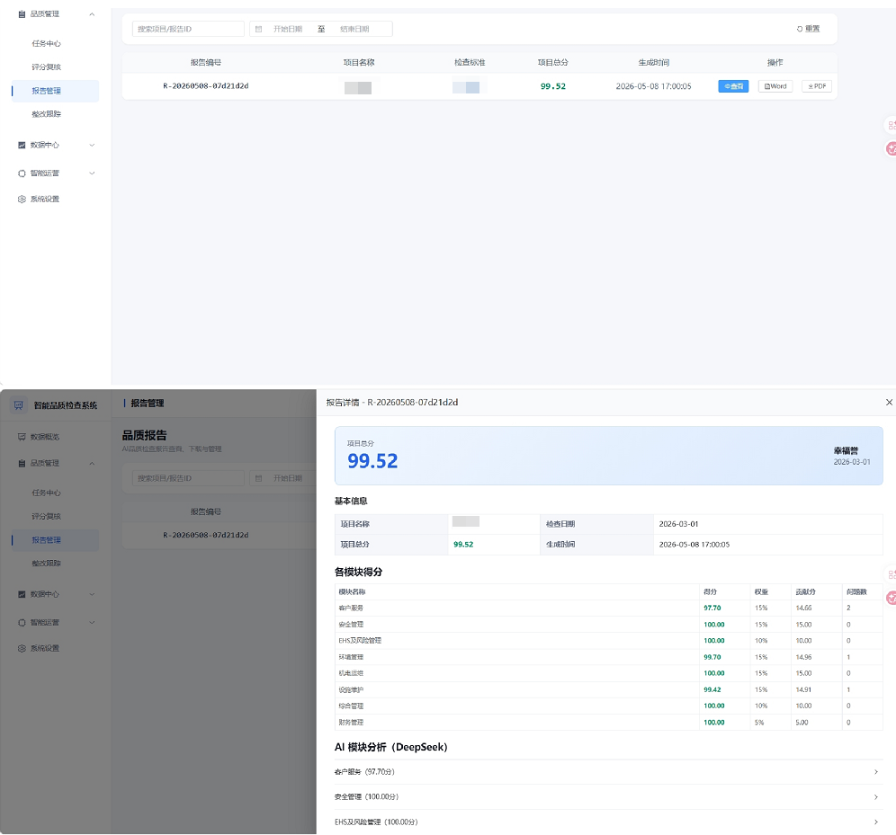
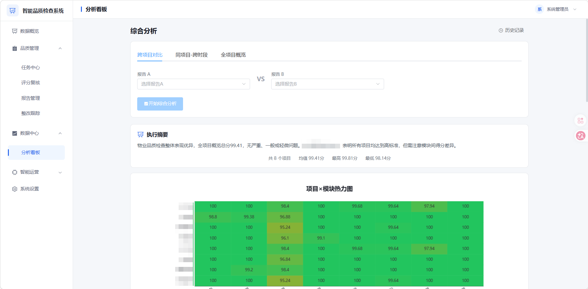

# AI-Driven Property Quality Inspection Multi-Agent System

> From "manual inspection → manual scoring → manual report writing" to "on-site recording → AI auto-scoring → one-click report generation", improving traditional quality inspection efficiency by over 60%.

---

## Product Screenshots

| PC Dashboard | Mobile Inspection | AI Report | Cross-Project Analysis |
|:---:|:---:|:---:|:---:|
|  |  |  |  |

---

## Problems Solved

| Pain Point | Traditional | AI Agent Solution |
|---|---|---|
| 8 modules, hundreds of items, inconsistent scoring | Manual scoring, high variance between inspectors | Agent 2 scores by LLM against standards, variance < 10% |
| Report generation takes 2-3 hours | Manual data aggregation + writing | Agent 3 auto-generates complete report with recommendations in < 2 min |
| Rectification review is manual and slow | Managers review photos and descriptions one by one | Agent 4 auto-reviews rectification quality with photo verification + confidence scoring |
| Cross-project comparison requires manual Excel work | Manual report consolidation | Agent 5 generates cross-project / cross-period analysis in one click |

---

## Product Architecture

```
User Layer     PC Dashboard (Element Plus)  │  Mobile (Vant 4)
────────────────────────────────────────────────────────────────
                   FastAPI Backend + LangGraph
────────────────────────────────────────────────────────────────
Agent 1          Agent 2          Agent 3          Agent 4
Data Collection  →  AI Scoring  →  Report Gen      Rectification
(Rule-based)     (Qwen-Plus)     (DeepSeek)        Review (Qwen-VL)

                         Agent 5: Cross-Project Analysis
              Cross-project / Cross-period / All-projects overview
────────────────────────────────────────────────────────────────
                      SQLite Data Layer
```

---

## Key Product Decisions

**1. Multi-Agent over Single Agent.** Single-agent prompts become bloated when handling scoring + reporting + review simultaneously — attention dilution causes ~15-20% accuracy drop. Breaking into 5 specialized agents lets each focus on one domain. [Anthropic's 2026 research](https://www.anthropic.com/engineering/building-effective-agents) confirms multi-agent systems outperform single-agent by 90%+ on multi-directional complex tasks.

**2. Database as Agent Communication Bus.** Agents communicate via SQLite, not direct RPC calls. Scoring Agent writes results to `scoring_results` table; Report Agent reads independently. Benefits: fault isolation (one agent down ≠ all down), full audit trail, zero coupling.

**3. Cost-Aware Model Selection.** Scoring and rectification review use Qwen-Plus (fast, affordable, task is structured). Report generation and cross-project analysis use DeepSeek (stronger reasoning for long-form synthesis). Agent 1 uses zero LLM calls — rule-based only.

**4. Dual-Device Strategy.** Mobile for inspectors (offline-capable, photo watermark, one-tap submit). PC for managers (dashboard, multi-dimensional analysis, report export). Same API, different UX.

→ Full decision records: [WHY_MULTI_AGENT.md](WHY_MULTI_AGENT.md)

---

## Tech Stack

`FastAPI` `Vue 3` `LangGraph` `DeepSeek` `Qwen-Plus` `Qwen-VL` `SQLite` `Element Plus` `Vant 4` `JWT`

---

## Documentation

| Doc | Content |
|---|---|
| [PRD.md](PRD.md) | Product requirements: business context, user roles, features, success metrics |
| [AGENTS.md](AGENTS.md) | Agent design: 5 agents' responsibilities, I/O, collaboration logic |
| [TECH_DESIGN.md](TECH_DESIGN.md) | Technical design: architecture, API design, database, security |
| [WHY_MULTI_AGENT.md](WHY_MULTI_AGENT.md) | Product decisions: multi-agent rationale, model selection, architectural tradeoffs |
| [DEPLOYMENT.md](DEPLOYMENT.md) | Deployment guide: server setup, Docker, env config |
| [USER_MANUAL.md](USER_MANUAL.md) | User manual: role-based operation guide |

---

## Quick Start

```bash
# Backend
cd backend
pip install -r requirements.txt
cp .env.example .env   # Add your API keys
uvicorn main:app --reload --port 8000

# Frontend
cd frontend
npm install
npm run dev
```

API docs at http://localhost:8000/docs
